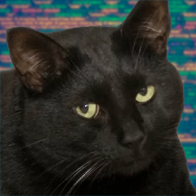
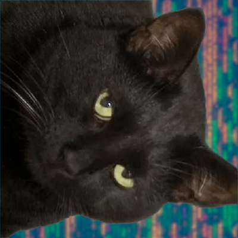

# c_bmp_image_rotation
## Laboratory work on programming languages (C)
### Build & run
- To build you need to type `make` in the root directory.
- After that to run you need to type `./build/rotator`

### Example of execution
 
